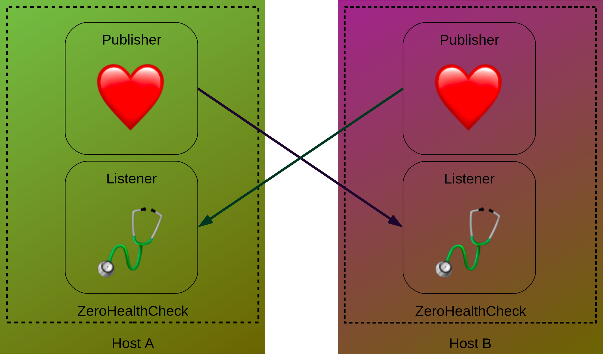

# ZeroHealthCheck

ZeroHC is a simple ZeroMQ-based host/service healthcheck monitor written in Python.

The service can run as one of, or both of:

- Publisher/Hearth: it frequently publishes hearthbeats on a ZeroMQ topic.
- Listener/Stethoscope: it subscribes to a Hearth's ZeroMQ topic, and notifies the client/admin as the listened host goes offline/back online.
  As ZeroMQ is brokerless, the Listener must know beforehand all the hosts that it must listen to.

When the listener determines that a host (publisher) is offline/dead, it can run a command (that usually will notify the user/admin that a host if down). Another command can be executed when the host is back online.
