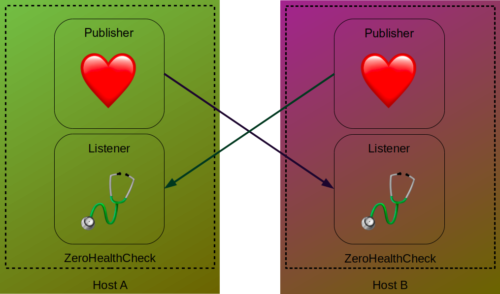

# ZeroHealthCheck

ZeroHC is a simple ZeroMQ-based host/service healthcheck monitor written in Python.

The service can run as one of, or both of:

- Publisher/Hearth: it frequently publishes hearthbeats on a ZeroMQ topic.
- Listener/Stethoscope: it subscribes to a Hearth's ZeroMQ topic, and notifies the client/admin as the listened host goes offline/back online.
  As ZeroMQ is brokerless, the Listener must know beforehand all the hosts that it must listen to.



When the listener determines that a host (publisher) is offline/dead, it can run a command (that usually will notify the user/admin that a host if down). Another command can be executed when the host is back online.

**This project is experimental and might have undesirable effects. Use it under your responsability!**

## Dependencies

- Python >= 3.7
- Libraries: pyzmq, loguru

## Usage example

Imagine you have three hosts where you want to run ZeroHC: HostA with IP 192.168.0.101, HostB with IP 192.168.0.102 and HostC with IP 192.168.0.103.
Running the following will start ZeroHC for all hosts, as both Hearths and Stethoscopes:

```sh
git clone https://www.github.com/David-Lor/ZeroHealthCheck
cd ZeroHealthCheck

# On HostA (192.168.0.101)
python . -h 192.168.0.102 -h 192.168.0.103

# On HostB (192.168.0.102)
python . -h 192.168.0.101 -h 192.168.0.103

# On HostC (192.168.0.103)
python . -h 192.168.0.102 -h 192.168.0.103
```

You can try it also on Docker containers (with IPs 172.55.55.{1-2-3}):

```sh
git clone https://www.github.com/David-Lor/ZeroHealthCheck
cd ZeroHealthCheck
docker network create -d bridge --attachable --subnet 172.55.55.0/24 --gateway 172.55.55.100 zerohc

# HostA (172.17.17.1)
docker run -it --rm -v $(pwd):/app:ro --network=zerohc --ip=172.55.55.1 --workdir=/app python:3.7 bash -c "pip install -r requirements.txt && python . -h 172.55.55.2 -h 172.55.55.3"

# HostB (172.17.17.2)
docker run -it --rm -v $(pwd):/app:ro --network=zerohc --ip=172.55.55.2 --workdir=/app python:3.7 bash -c "pip install -r requirements.txt && python . -h 172.55.55.1 -h 172.55.55.3"

# HostC (172.17.17.3)
docker run -it --rm -v $(pwd):/app:ro --network=zerohc --ip=172.55.55.3 --workdir=/app python:3.7 bash -c "pip install -r requirements.txt && python . -h 172.55.55.1 -h 172.55.55.2"
```

### Notifications

The commands shown do nothing else than print on screen that a host is down or back online, but the common use case of this tool is to notify the user whenever a host is down or back online.
This can be done with the `--on-dead` and `--on-alive` modifiers.

The following example will notify through Telegram when a host is offline:

```sh
git clone https://www.github.com/David-Lor/ZeroHealthCheck
cd ZeroHealthCheck
BOT_TOKEN="Your Telegram Bot Token"
CHAT_ID="Your Telegram ChatID"

# Publisher/Hearth (you can turn it on/off to check both on-dead and on-alive commands)
python . --publisher --hearthbeat-frequency=1

# Listener
python . --listener -h localhost --time-to-death=3 --on-dead="curl -s 'https://api.telegram.org/bot$BOT_TOKEN/sendMessage?chat_id=$CHAT_ID&text=Host %ip is OFFLINE'" --on-alive="curl -s 'https://api.telegram.org/bot$BOT_TOKEN/sendMessage?chat_id=$CHAT_ID&text=Host %ip is BACK ONLINE'"
```

The placeholder `%ip` gets replaced with the publisher host that is down/up.

## CLI Arguments

The full list or arguments for the CLI interface is the following:

- Service arguments:
	- `--publisher`/`--hearth`/`-p`: enable the hearthbeat/status publisher
	- `--listener`/`--stethoscope`/`-s`: enable the listener
	- If none of these are specified, will init the Publisher, and the Listener if hosts are defined
- Publisher arguments:
	- `--publisher-port`/`--hearth-port`/`-pp`/`-hp`: ZeroMQ port where to bind the message publish (default: `5555`)
	- `--publisher-topic`/`--hearth-topic`/`-pt`/`-ht`: ZeroMQ topic name (the listeners must use the same) (default: `hearthbeat`)
	- `--hearthbeat-frequency`/`--hearth-frequency`/`--beat-frequency`/`-hf`: time in seconds between hearthbeat messages (default: `5` seconds)
- Listener arguments:
	- `--listener-host`/`-h`: each one of the remote hosts to listen to its hearthbeats. This can be repeated. Format: `host`/`host:port`/`host@topic`/`host:port@topic` (only host is required; port default: `5555`; topic default: `hearthbeat`)
	- `--time-to-death`/`-td`/`-ttd`: time limit with no hearthbeats received for a host to declare it as dead, in seconds (default: `15` seconds)
	- `--on-dead`/`--dead`/`--on-down`/`--down`/`-d`: command to execute when a host is offline
	- `--on-alive`/`--alive`/`-a`: command to execute when a host is back online
	- on-dead and on-alive commands can use the following placeholders:
		- `%ip`: replaced with the host ip
- System/general arguments:
	- `--log`/`--level`/`--log-level`: set the log level (one of: TRACE, DEBUG, INFO, WARNING, ERROR; default: `INFO`; case insensitive)

## Changelog

- 0.1.1 - Add pretty logs (with loguru)
- 0.0.1 - initial version

## TODO

- Add setup.py + upload to pypi
- Run on-dead/on-alive commands async
- Add aliases to hosts
- Add tests
- Set priorities on Listeners so on-dead/on-alive commands only run once
- Export binary (pyinstaller?)
